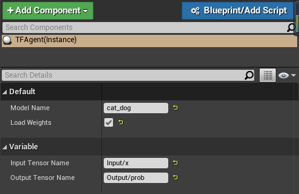

# Unreal-lightweight-Tensorflow-plugin
UE4 Tensorflow plugin based on [TensorFlow C API](https://www.tensorflow.org/install/lang_c) and [CPPFlow](https://github.com/serizba/cppflow). More lighweight than [tensorflow-ue4](https://github.com/getnamo/tensorflow-ue4) but with limits.

This demo is derived from [WhiteBoard](https://forums.unrealengine.com/community/released-projects/13825-whiteboard-blueprint).

### Features

* No other plugins such as UnrealEngine Python、SocketIO Client needed

* No local Python environment needed

* Only inference with trained model supported

* CPU-Only API

### Usage
* [Download](https://storage.googleapis.com/tensorflow/libtensorflow/libtensorflow-cpu-windows-x86_64-2.4.0.zip) Tensorflow C API. Move tensorflow.dll and tensorflow.lib to ./Plugins/Lightweight_Tensor/Binaries/Win64/

* Train your Tensorflow model and save PB model
```python
# ./Content/TensorFlow/scripts/train.py

output_graph_def = tf.graph_util.convert_variables_to_constants(
        sess,
        tf.get_default_graph().as_graph_def(),
        output_node_names=['Output/prob'])

with tf.gfile.GFile('../output/trained_model/pb_only/cat_dog.pb', "wb") as f:
        f.write(output_graph_def.SerializeToString())
```

* Store pre-trained PB model at '{ProjectDir}/Content/TensorFlow/'

* Add TFAgent Actor to your level and setup properties  


* Prepare network inputs from UE data, the same as inputs you use to train the model
```CPP
// ./Source/WhiteBoard/MyGameModeBase.cpp

// Read the pixels from the RenderTarget and store them in a FColor array
TArray<FColor> SurfData;
FRenderTarget* RenderTarget = MyRenderTarget->GameThread_GetRenderTargetResource();
RenderTarget->ReadPixels(SurfData);

// Indexing
FIntPoint XY = RenderTarget->GetSizeXY();

// Saving test image and calculate gray scale
std::ofstream ofile;
ofile.open(TCHAR_TO_UTF8(*(FPaths::ProjectContentDir() + FString("RGB.txt"))), std::ios::trunc);
for (FColor f : SurfData)
{
	ofile << int(f.R) << "," << int(f.G) << "," << int(f.B) << std::endl;
}
ofile.close();

// Prepare grayscale data
TArray<float> img_data;
TArray<float> out;
for (FColor f : SurfData)
{
	float x = (float(f.B) * 0.07 + float(f.G) * 0.72 + float(f.R) * 0.21) / 255.f;
	img_data.Add(x);
}
```

* Get preditcions by TFAgent->Inference()
```CPP
// ./Source/WhiteBoard/MyGameModeBase.cpp

// Get prediction
TFActor->Inference(img_data, out);
```

### Sample
* WIP
